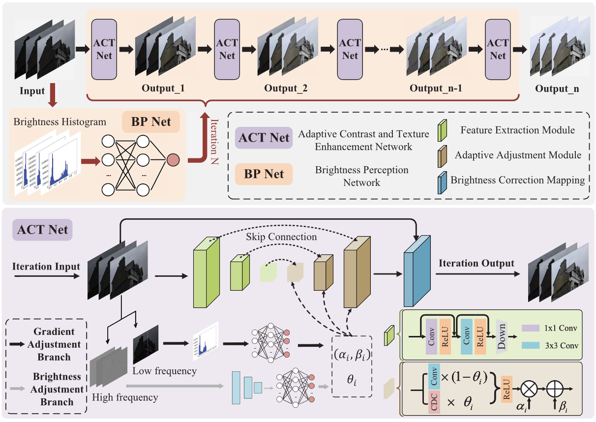

# Brightness Perceiving for Recursive Low-Light Image Enhancement


PyTorch implementation of BPNet for recursive low-light image enhancement.

## Framework Overview



*Figure. The overall architecture of the recursive enhancement framework, consisting of ACT-Net and BP-Net.*

## Requirements

- Python 3.8+
- torch
- torchvision
- numpy
- opencv-python
- Pillow
- kornia

## Data Preparation

Place the training and test data as follows:

```text
data/
├── step_1/
│   ├── train/      # Level 4 images for ACT-Net pretraining
│   ├── val/
│   └── val_gt/
├── step_2/
│   ├── train/
│   ├── val/
│   └── val_gt/
├── step_3/
│   ├── train/
│   ├── val/
│   └── val_gt/
├── test_in/
├── test_out/
└── test_gt/
```

## Training

### Step 1: Train ACT-Net

```bash
python step1_train_actnet_paper_aligned.py
```

### Step 2: Train BP-Net

```bash
python step2_train_bpnet_paper_aligned.py
```

### Step 3: Joint Training

```bash
python step3_train_joint_paper_aligned.py
```

## Inference

### Final model

```bash
python test_recursive_llie_paper_aligned.py \
  --mode final \
  --test_images_path ./data/test_in/ \
  --results_folder ./data/test_out/ \
  --pretrain_dir ./data/step_3/save_model/ACTNet_best.pth \
  --class_pretrain_dir ./data/step_3/save_model/BPNet_best.pth \
  --gt_path ./data/test_gt/
```

### ACT-Net only

```bash
python test_recursive_llie_paper_aligned.py \
  --mode step1 \
  --test_images_path ./data/test_in/ \
  --results_folder ./data/test_out/ \
  --pretrain_dir ./data/step_1/save_model/ACTNet_best.pth \
  --gt_path ./data/test_gt/
```

## Note

Please ensure that `model.light_class()` is implemented as a histogram-based BP-Net.

## Citation

If you use this code, please cite:

Wang H, Peng L, Sun Y, et al. Brightness perceiving for recursive low-light image enhancement[J]. IEEE Transactions on Artificial Intelligence, 2023, 5(6): 3034-3045.

## Copyright Notice

This code is provided for academic research and educational use only.  
If you use this code, in whole or in part, in your research or any resulting publication, please cite the following paper:

> Wang H, Peng L, Sun Y, et al. Brightness perceiving for recursive low-light image enhancement[J]. *IEEE Transactions on Artificial Intelligence*, 2023, 5(6): 3034-3045.

```bibtex
@article{wang2023brightness,
  title={Brightness perceiving for recursive low-light image enhancement},
  author={Wang, Haodian and Peng, Long and Sun, Yuejin and et al.},
  journal={IEEE Transactions on Artificial Intelligence},
  volume={5},
  number={6},
  pages={3034--3045},
  year={2023}
}
